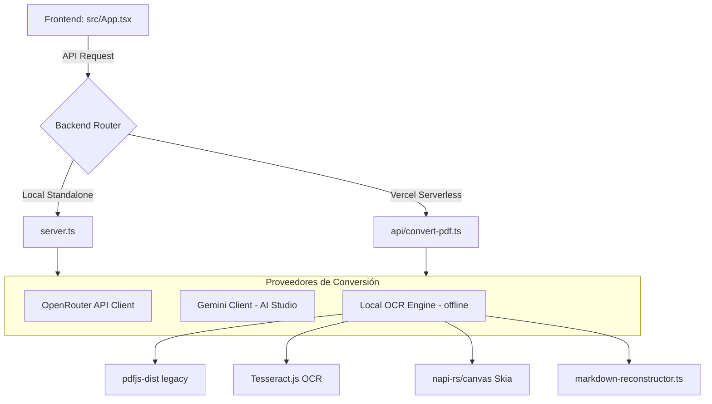

# Arquitectura del Proyecto

Este documento describe la arquitectura de software y el flujo de datos del **Conversor de PDF a Markdown**.

---

## 1. Diseño General

La aplicación está construida utilizando un diseño híbrido de **Single Page Application (SPA)** con un servidor de backend **Express** que también se compila para **Vercel Serverless Functions**.

---

## 2. Componentes Principales

### 2.1 Frontend (`src/App.tsx`)
La interfaz de usuario está desarrollada en React 19 y Tailwind CSS 4.
*   **Monolito de UI**: Toda la lógica visual, la subida de archivos (conversión a Base64), el selector de proveedores y el renderizado Markdown (mediante `react-markdown`) residen en un solo archivo principal (`src/App.tsx`).
*   **Gestión de Estado**: Controla la subida de PDFs, errores de red, advertencias específicas de OCR y almacena las claves API del usuario de manera persistente en `localStorage`.

### 2.2 Servidor y APIs
El backend está unificado bajo dos puntos de entrada compatibles:
1.  **Servidor Standalone (`server.ts`)**: Servidor Express que monta a Vite en modo middleware para desarrollo local y sirve la API `/api/convert-pdf` en producción.
2.  **Serverless Handler (`api/convert-pdf.ts`)**: Endpoint compatible con el entorno serverless de Vercel.

---

## 3. Proveedores de Conversión

La aplicación soporta tres motores para transformar archivos PDF a Markdown:

### A. OpenRouter (`lib/openrouter-client.ts`)
*   Realiza llamadas de red a la API de OpenRouter.
*   Implementa una cadena de **fallbacks automáticos**: si un modelo gratuito o preferido falla o arroja rate limit (HTTP 429), reintenta la conversión usando el siguiente modelo en la cadena (`gemini-2.5-flash` -> `gemini-2.5-flash-lite`).

### B. Google AI Studio BYOK (`lib/gemini-client.ts`)
*   Se conecta directamente con la API oficial de Google Gemini.
*   Permite a los usuarios ingresar su propia clave de API (BYOK - Bring Your Own Key) la cual se prioriza sobre la clave configurada en las variables de entorno del servidor.

### C. Extracción Local y OCR sin IA (`lib/local-ocr-client.ts`)
Es un motor 100% offline, gratuito y local. Opera de la siguiente manera:
1.  **Lectura Digital**: Carga el PDF usando `pdfjs-dist` y extrae el texto junto con sus coordenadas cartesianas y nombre/tamaño de tipografías.
2.  **Decisión del Pipeline**:
    *   Si una página tiene **suficiente texto digital** (≥30 caracteres), se procesa mediante el pipeline de extracción de texto digital.
    *   Si es una página escaneada o basada en imágenes, se renderiza en memoria a 2x escala usando `@napi-rs/canvas` y se le aplica OCR local con `Tesseract.js`.
3.  **Reconstructor Markdown (`lib/markdown-reconstructor.ts`)**:
    *   **Agrupamiento por Bloques Semánticos**: Agrupa líneas consecutivas del mismo párrafo o lista y las une con espacios, evitando la fragmentación del texto.
    *   **Clustering de Fuentes**: Mapea dinámicamente los tamaños de letra más grandes del documento a niveles de encabezado H1–H4.
    *   **Detección de Cambios de Estilo**: Separa secciones con saltos de párrafo doble (`\n\n`) cuando detecta un cambio en el estilo de fuente (negritas, itálicas) o en el identificador tipográfico dominante (ej: de título a descripción).
