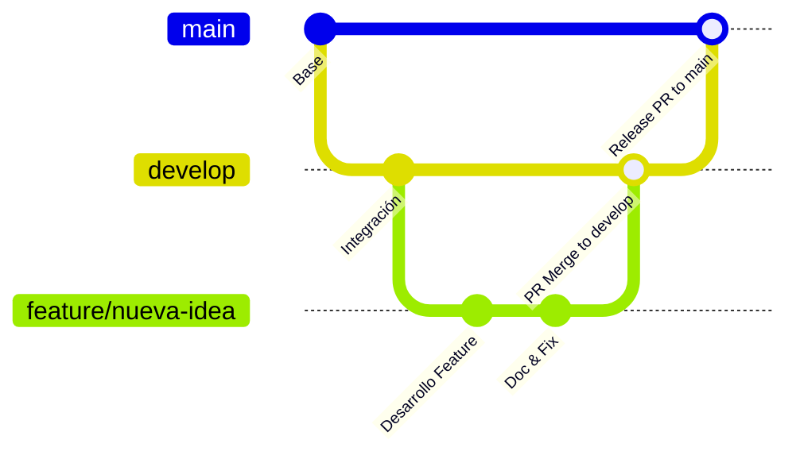

# Flujo de Trabajo Git y Ciclo de Ramas

Este documento describe el modelo de branching y el flujo de promoción de código que rige este repositorio.

---

## 1. Ramas del Proyecto

El repositorio se organiza bajo el siguiente esquema de ramas:

| Rama | Tipo | Descripción |
|---|---|---|
| `main` | Protegida | Representa el código estable en producción. **Los pushes directos están bloqueados.** Toda integración debe ser a través de un Pull Request aprobado. |
| `develop` | Integración | Rama donde se recopilan, prueban e integran las características antes de subirse a producción. |
| `feature/*` | Temporal | Ramas creadas para desarrollar una característica o corrección específica (ej. `feature/local-ocr`). |

---

## 2. Flujo de Trabajo Paso a Paso



### Paso 1: Crear una rama de característica
Toda nueva funcionalidad debe partir de `develop`:
```bash
git checkout develop
git pull origin develop
git checkout -b feature/nombre-de-tu-feature
```

### Paso 2: Desarrollar y realizar commits
Realiza los commits con mensajes descriptivos.
```bash
git add .
git commit -m "feat: descripción corta de la funcionalidad"
```

### Paso 3: Subir la rama y crear Pull Request a `develop`
Sube tu rama al repositorio remoto y abre un Pull Request hacia la rama `develop`:
```bash
git push -u origin feature/nombre-de-tu-feature
gh pr create --base develop --head feature/nombre-de-tu-feature --title "feat: título" --body "Descripción de los cambios"
```

### Paso 4: Revisión y Fusión a `develop`
Una vez aprobado el Pull Request y pasadas las pruebas (como `npm run lint`), el PR se fusiona y la rama remota se elimina:
```bash
gh pr merge --merge --delete-branch
```

### Paso 5: Promoción de Código (`develop` -> `main`)
Para liberar una nueva versión o release a producción, se abre un Pull Request desde la rama `develop` hacia `main`:
```bash
git checkout develop
git pull origin develop
gh pr create --base main --head develop --title "release: v1.X.X" --body "Descripción de la nueva versión"
```
Una vez fusionado este PR en GitHub, la versión queda liberada en la rama principal.
